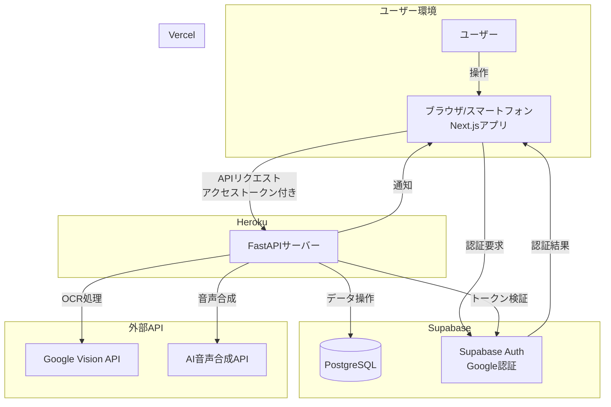
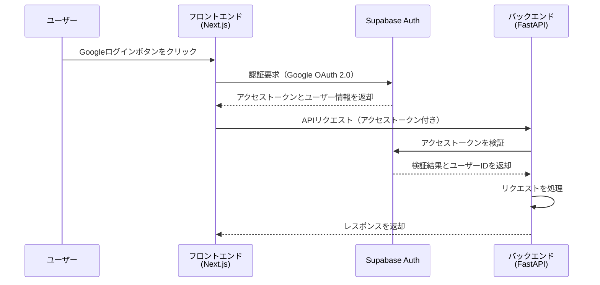
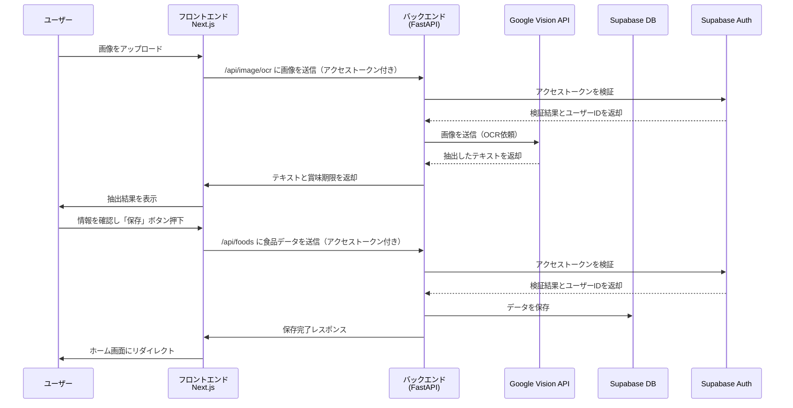

承知いたしました。前回の詳細設計では、Supabaseの認証機能を使用したGoogle認証について考慮しておりませんでした。ご指摘ありがとうございます。

以下に、Supabaseの認証機能を使用してGoogle認証を行うように修正した詳細設計を、全てのセクションを含めて再度ご提供いたします。

---

# 冷蔵庫賞味期限チェッカー - 詳細設計書

---

## 目次

1. [システム全体のアーキテクチャ](#1-システム全体のアーキテクチャ)
2. [画面設計](#2-画面設計)
   - [2.1. ログイン画面](#21-ログイン画面)
   - [2.2. ホーム画面（賞味期限リスト表示）](#22-ホーム画面賞味期限リスト表示)
   - [2.3. 画像アップロード画面](#23-画像アップロード画面)
   - [2.4. 食品詳細画面](#24-食品詳細画面)
   - [2.5. 設定画面](#25-設定画面)
3. [API設計](#3-api設計)
   - [3.1. 認証・認可](#31-認証認可)
   - [3.2. 食品データAPI](#32-食品データapi)
   - [3.3. 画像処理API](#33-画像処理api)
   - [3.4. 通知API](#34-通知api)
4. [データベース設計](#4-データベース設計)
   - [4.1. テーブル定義](#41-テーブル定義)
5. [サーバー連携設計](#5-サーバー連携設計)
   - [5.1. フロントエンドとバックエンドの連携](#51-フロントエンドとバックエンドの連携)
   - [5.2. バックエンドと外部APIの連携](#52-バックエンドと外部apiの連携)
6. [セキュリティ対策](#6-セキュリティ対策)
7. [デプロイ計画](#7-デプロイ計画)
8. [テスト計画](#8-テスト計画)
9. [構成図](#9-構成図)
   - [9.1. システムアーキテクチャ図](#91-システムアーキテクチャ図)
   - [9.2. シーケンス図](#92-シーケンス図)
10. [技術詳細](#10-技術詳細)
    - [10.1. フロントエンド (Next.js)](#101-フロントエンド-nextjs)
    - [10.2. バックエンド (FastAPI)](#102-バックエンド-fastapi)
11. [開発環境](#11-開発環境)
12. [今後の拡張](#12-今後の拡張)
13. [備考](#13-備考)

---

## 1. システム全体のアーキテクチャ

- **フロントエンド**：Next.js（TypeScript） + Material UI
- **バックエンド**：Python + FastAPI
- **データベース**：Supabase（PostgreSQL）
- **認証・認可**：**Supabase Auth**（Google OAuth 2.0を使用）
- **外部API**：
  - **Google Vision API**（OCR機能）
  - **AI音声合成API**（gTTSなど）
- **デプロイ環境**：
  - フロントエンド：Vercel
  - バックエンド：Heroku
- **コンテナ化**：Docker

---

## 2. 画面設計

### 2.1. ログイン画面

**概要**：ユーザーがGoogleアカウントでログインするための画面。

**要素**：

- **Googleログインボタン**
  - Supabase Authを利用したGoogleログインを開始。
- **アプリのロゴと説明文**
  - ユーザーにアプリの目的や特徴を簡潔に伝える。

**遷移**：

- ログイン成功後、**ホーム画面**へリダイレクト。
- ログイン失敗時、エラーメッセージを表示。

---

### 2.2. ホーム画面（賞味期限リスト表示）

**概要**：登録された食品とその賞味期限を一覧表示。

**要素**：

- **ヘッダー**
  - ロゴ
  - 「食品追加」ボタン
  - 「設定」アイコン

- **賞味期限リスト**
  - 食品名
  - 賞味期限
  - 期限までの日数
  - カラーコード（緑：安全、黄：注意、赤：危険）
  - 各食品の詳細ボタン
  - **レシピ提案ボタン**（賞味期限が7日以内の食品のみ表示）

- **レシピ提案モーダル**
  - モーダルヘッダー
    - タイトル：「賞味期限が近い食材でレシピを作る」
    - 閉じるボタン
  - 食材選択セクション
    - 賞味期限が7日以内の食材一覧（賞味期限が近い順にソート）
      - チェックボックス
      - 食材名
      - 残り日数表示
    - 最大4つまで選択可能
    - 選択した食材がある場合のみ「レシピを取得」ボタンを表示
  - レシピ表示セクション（レシピ取得後）
    - レシピ名
    - 調理時間
    - 難易度（簡単、普通、少し難しい）
    - 材料リスト
    - 調理手順（箇条書き）
    - 調理のコツ（オプション）
  - モーダルフッター
    - 「閉じる」ボタン

- **ページネーション**
  - 多数の食品がある場合のためのページ切り替え機能。

**機能**：

- 賞味期限の近い順にソート。
- 食品名でのフィルタリング。

**遷移**：

- 「食品追加」ボタン押下で、**画像アップロード画面**へ。
- 各食品の詳細ボタン押下で、**食品詳細画面**へ。
- 「設定」アイコン押下で、**設定画面**へ。

---

### 2.3. 食品登録画面　画像アップロード画面

**概要**：食品の賞味期限を含む画像をアップロードし、OCRで情報を取得。

**要素**：

- **画像アップロードエリア**
  - カメラ起動ボタン（モバイルデバイス）
  - ファイル選択ボタン（デスクトップ）

- **プレビュー表示**
  - アップロードされた画像のプレビュー

- **OCR結果表示**
  - 抽出された賞味期限
  - 抽出された食品名（オプション）

- **手動入力フィールド**
  - 食品名入力欄
  - 賞味期限入力欄（カレンダーウィジェット）
  - カテゴリ選択ドロップダウン

- **「保存」ボタン**

**機能**：

- 画像アップロード時にバックエンドAPIを呼び出し、OCR処理。
- OCR結果を表示し、必要に応じて手動で修正。

**遷移**：

- 「保存」ボタン押下で、データを保存し、**ホーム画面**へリダイレクト。

---

### 2.4. 食品詳細画面

**概要**：特定の食品の詳細情報を表示・編集。

**要素**：

- **食品名表示**
- **賞味期限表示**
- **カテゴリ表示**
- **登録日表示**
- **画像表示**（アップロードされた画像の表示）
- **編集ボタン**
- **削除ボタン**

**機能**：

- 「編集」ボタンで情報の編集が可能。
- 「削除」ボタンで食品情報を削除。

**遷移**：

- 「編集」ボタン押下で、フィールドが編集可能に。
- 「保存」ボタン押下でデータを更新し、**ホーム画面**へ。
- 「削除」ボタン押下でデータを削除し、**ホーム画面**へ。

---

### 2.5. 設定画面

**概要**：ユーザー情報と通知設定を表示・編集。

**要素**：

- **ユーザー情報表示**
  - ユーザー名
  - メールアドレス
  - プロフィール画像（Googleアカウントから取得）

- **通知設定**
  - 通知オン/オフスイッチ
  - 通知タイミング選択（例：1日前、当日）

- **音声通知設定**
  - 音声通知のオン/オフ

- **ログアウトボタン**

**機能**：

- 通知設定の変更
- ログアウト機能（Supabase Authを使用）

**遷移**：

- 「ログアウト」ボタン押下で、**ログイン画面**へリダイレクト。

---

## 3. API設計

### 3.1. 認証・認可

**Supabase Auth**を利用して、フロントエンドとバックエンドの両方でユーザー認証を行います。

- **認証フロー**：
  - フロントエンドでSupabase AuthのGoogleログインを使用。
  - ログイン後、Supabaseから提供されるアクセストークンを取得。
  - バックエンドAPIへのリクエスト時に、このアクセストークンを使用。

- **認可**：
  - バックエンドで受け取ったアクセストークンをSupabaseのAPIを使って検証。
  - ユーザー情報を取得し、リクエストを処理。

### 3.2. 食品データAPI

**エンドポイント一覧**：

- **`GET /api/foods`**
  - **説明**：ユーザーの全食品データを取得。
  - **認証**：アクセストークン必須。
  - **レスポンス**：

    ```json
    {
      "items": [
        {
          "id": "string",
          "name": "string",
          "expiration_date": "YYYY-MM-DD",
          "category": "string",
          "image_url": "string",
          "created_at": "YYYY-MM-DDTHH:MM:SS",
          "updated_at": "YYYY-MM-DDTHH:MM:SS"
        },
        ...
      ],
      "total": 100,
      "page": 1,
      "limit": 20
    }
    ```

- **`GET /api/foods/{food_id}`**
  - **説明**：特定の食品データを取得。
  - **認証**：アクセストークン必須。

- **`POST /api/foods`**
  - **説明**：新しい食品データを作成。
  - **認証**：アクセストークン必須。
  - **リクエストボディ**：

    ```json
    {
      "name": "string",
      "expiration_date": "YYYY-MM-DD",
      "category": "string",
      "image_url": "string"
    }
    ```

- **`PUT /api/foods/{food_id}`**
  - **説明**：食品データを更新。
  - **認証**：アクセストークン必須。
  - **リクエストボディ**：

    ```json
    {
      "name": "string",
      "expiration_date": "YYYY-MM-DD",
      "category": "string"
    }
    ```

- **`DELETE /api/foods/{food_id}`**
  - **説明**：食品データを削除。
  - **認証**：アクセストークン必須。

- **`POST /api/foods/{food_id}/recipes`**
  - **説明**：特定の食材を使用したレシピを生成。
  - **認証**：アクセストークン必須。
  - **リクエストボディ**：
    ```json
    {
      "ingredients": ["string"],  // 追加の食材（オプション）
      "preferences": {
        "cooking_time": "short|medium|long",  // オプション
        "difficulty": "easy|medium|hard"      // オプション
      }
    }
    ```
  - **レスポンス**：
    ```json
    {
      "recipes": [
        {
          "name": "string",
          "cooking_time": "30分",
          "difficulty": "簡単|普通|少し難しい",
          "ingredients": ["string", "string", ...],
          "steps": ["string", "string", ...],
          "tips": "string"  // 調理のコツやポイント
        },
        // ... 3件まで
      ]
    }
    ```

### 3.3. 画像処理API

**エンドポイント**：

- **`POST /api/image/ocr`**
  - **説明**：画像を受け取り、Google Vision APIを使ってOCR処理を行う。
  - **認証**：アクセストークン必須。
  - **リクエスト**：
    - **ヘッダー**：`Content-Type: multipart/form-data`
    - **ボディ**：画像ファイル（`image`フィールド）
  - **レスポンス**：

    ```json
    {
      "text": "string",
      "expiration_date": "YYYY-MM-DD",
      "name": "string"
    }
    ```

### 3.4. 通知API

**エンドポイント**：

- **`GET /api/notifications`**
  - **説明**：ユーザーの通知設定を取得。
  - **認証**：アクセストークン必須。
  - **レスポンス**：

    ```json
    {
      "enabled": true,
      "timing": "on_expiry_date",
      "voice_enabled": true
    }
    ```

- **`PUT /api/notifications`**
  - **説明**：ユーザーの通知設定を更新。
  - **認証**：アクセストークン必須。
  - **リクエストボディ**：

    ```json
    {
      "enabled": true,
      "timing": "on_expiry_date",
      "voice_enabled": true
    }
    ```

- **`POST /api/notifications/send`**
  - **説明**：期限が近づいた食品について通知を送信。
  - **認証**：アクセストークン必須。
  - **リクエストボディ**：

    ```json
    {
      "food_id": "string"
    }
    ```

  - **レスポンス**：

    ```json
    {
      "message": "Notification sent",
      "status": "success"
    }
    ```

---

## 4. データベース設計

### 4.1. テーブル定義

Supabaseのユーザー管理機能を使用するため、ユーザーデータはSupabaseの`auth.users`テーブルに格納されます。追加のユーザー情報が必要な場合は、カスタムテーブルを作成します。

#### **profiles テーブル**（ユーザー追加情報）

| カラム名        | データ型      | NULL許可 | 備考                            |
| --------------- | ------------- | -------- | ------------------------------- |
| id              | UUID          | NOT NULL | ユーザーID（主キー、外部キー）  |
| name            | TEXT          | NOT NULL | ユーザー名                      |
| profile_image   | TEXT          | NULL     | ロフィール画像のURL           |
| created_at      | TIMESTAMP     | NOT NULL | 作成日時                        |
| updated_at      | TIMESTAMP     | NOT NULL | 更新日時                        |

#### **foods テーブル**

| カラム名         | データ型      | NULL許可 | 備考                           |
| ---------------- | ------------- | -------- | ------------------------------ |
| id               | UUID          | NOT NULL | 食品ID（主キー）               |
| user_id          | UUID          | NOT NULL | ユーザーID（外部キー）         |
| name             | TEXT          | NOT NULL | 食品名                         |
| expiration_date  | DATE          | NOT NULL | 賞味期限                       |
| category         | TEXT          | NULL     | カテゴリ                       |
| image_url        | TEXT          | NULL     | 画像のURL                      |
| created_at       | TIMESTAMP     | NOT NULL | 作成日時                       |
| updated_at       | TIMESTAMP     | NOT NULL | 更新日時                       |

#### **notification_settings テーブル**

| カラム名        | データ型      | NULL許可 | 備考                            |
| --------------- | ------------- | -------- | ------------------------------- |
| user_id         | UUID          | NOT NULL | ユーザーID（主キー、外部キー）  |
| enabled         | BOOLEAN       | NOT NULL | 通知のオン/オフ                 |
| timing          | TEXT          | NOT NULL | 通知タイミング                  |
| voice_enabled   | BOOLEAN       | NOT NULL | 音声通知のオン/オフ             |
| created_at      | TIMESTAMP     | NOT NULL | 作成日時                        |
| updated_at      | TIMESTAMP     | NOT NULL | 更新日時                        |

---

## 5. サーバー連携設計

### 5.1. フロントエンドとバックエンドの連携

- **通信プロトコル**：HTTPS
- **データフォーマット**：JSON
- **認証方法**：
  - フロントエンドでSupabase Authを使用してログインし、アクセストークンを取得。
  - バックエンドAPIへのリクエスト時に、このアクセストークンをHTTPヘッダーの`Authorization`フィールドに含める。

    ```
    Authorization: Bearer <access_token>
    ```

- **アクセストークンの検証**：
  - バックエンドでSupabaseのJWTシークレットキーを使用してトークンを検証。
  - トークンからユーザーIDを取得し、リクエストを処理。

### 5.2. バックエンドと外部APIの連携

#### **Google Vision API**

- **用途**：画像からテキストを抽出（OCR）。
- **通信**：バックエンドサーバーからHTTPSでリクエスト。
- **認証**：サービスアカウントキーを使用。

#### **AI音声合成API**

- **用途**：テキストから音声ファイルを生成。
- **通信**：バックエンドサーバーからHTTPSでリクエスト。
- **認証**：APIキーやサービスアカウントを使用。

---

## 6. セキュリティ対策

- **SSL/TLSの導入**
  - 全ての通信をHTTPSで行い、データの盗聴や改ざんを防止。
- **アクセストークンによる認証**
  - トークンの有効期限設定。
  - 秘密鍵（SupabaseのJWTシークレットキー）の安全な管理。
- **入力値のバリデーション**
  - フロントエンドとバックエンドの両方で実装。
  - SQLインジェクションやXSS攻撃の防止。
- **CORS設定**
  - 許可されたオリジンからのリクエストのみを受け付ける。
- **環境変数の利用**
  - APIキーや秘密情報を環境変数として管理。
- **パスワードの安全な取り扱い**
  - Supabase Authがパスワード管理を行うため、追加の処理は不要。

---

## 7. デプロイ計画

- **フロントエンド（Next.js）**
  - **デプロイ先**：Vercel
  - **手順**：
    - GitHubリポジトリと連携し、自動デプロイを設定。
    - 環境変数の設定（SupabaseのURLとパブリックAPIキーなど）。

- **バックエンド（FastAPI）**
  - **デプロイ先**：Heroku
  - **手順**：
    - Dockerイメージをビルドし、Heroku Container Registryにプッシュ。
    - 環境変数の設定（SupabaseのURL、サービスキー、JWTシークレットキー、外部APIキーなど）。

- **データベース（Supabase）**
  - **設定**：
    - 本番環境用のプロジェクトを作成。
    - テーブルのマイグレーションを実行。
    - 認証プロバイダー（Google）の設定を有効化。

- **外部サービス連携**
  - **Google Cloud Project**の設定。
  - **AI音声合成API**のアカウント設定。

---

## 8. テスト計画

- **ユニットテスト**
  - バックエンドのAPIエンドポイントのテスト（pytest）。
  - フロントエンドのコンポーネントテスト（Jest）。
- **統合テスト**
  - フロントエンドとバックエンドの連携テスト。
  - Supabase Authとの連携テスト。
  - 外部APIとの連携テスト。
- **E2Eテスト**
  - 主要なユーザーフローのテスト（Cypress）。
  - モバイルデバイスでの動作確認。
- **パフォーマンステスト**
  - API応答時間の測定。
  - 画像アップロード処理の速度確認。
- **セキュリティテスト**
  - 認証・認可のテスト。
  - 入力値のバリデーションテスト。

---

## 9. 構成図

### 9.1. システムアーキテクチャ図



---

### 9.2. シーケンス図

#### **認証フローのシーケンス**



#### **賞味期限登録のシーケンス**



---

## 10. 技術詳細

### 10.1. フロントエンド (Next.js)

- **UIライブラリ**：Material UI
- **状態管理**：Context API または Redux
- **認証**：Supabase Auth を利用したGoogle認証
  - `@supabase/supabase-js`ライブラリを使用
- **APIクライアント**：Axios または Fetch API
- **画像処理**：ブラウザのFile API、Canvas API
- **その他**：
  - TypeScriptによる型安全な開発
  - ESLintとPrettierによるコード品質の維持

### 10.2. バックエンド (FastAPI)

- **Webフレームワーク**：FastAPI
- **データベース**：Supabase（PostgreSQL）
  - `supabase-py`ライブラリを使用
- **認証**：アクセストークン（JWT）をSupabaseのJWTシークレットキーで検証
- **ORM**：SQLAlchemy または直接SQLクエリ
- **OCR**：Google Vision API クライアントライブラリ
- **音声合成**：gTTS、または他の音声合成API
- **非同期処理**：asyncio、FastAPIの機能を活用
- **その他**：
  - Python 3.10以上を使用
  - ロギング機能の実装
  - エラーハンドリングの統一
- **AI機能**：
  - Google Vision API クライアントライブラリ（OCR用）
  - Google Gemini API（レシピ生成用）
    - プロンプトエンジニアリングによる最適なレシピ提案
    - コンテキストを考慮した自然な日本語生成

---

## 11. 開発環境

### 11.1. 開発ツール

- **エディタ/IDE**：Visual Studio Code、PyCharm
- **バージョン管理**：Git、GitHub
- **タスク管理**：Trello、GitHub Projects
- **コミュニケーション**：Slack、Zoom

### 11.2. 環境構築

- **コンテナ化**：Docker、Docker Compose によるローカル開発環境の構築
- **依存関係管理**：
  - フロントエンド：npm、yarn
  - バックエンド：pipenv、poetry
- **環境変数の管理**：`.env`ファイルを使用し、`dotenv`ライブラリで読み込み

---

## 12. 今後の拡張

- **食品カテゴリ機能**：食品ごとにカテゴリを設定し、フィルタリングやソートを可能にする。
- **レシピ連携**：賞味期限が近い食品を使ったレシピを提案。
- **買い物リスト機能**：賞味期限が切れた食品を自動で買い物リストに追加。
- **AIによる食品認識**：画像から自動で食品名とカテゴリを推定。
- **プッシュ通知**：アプリを閉じていても通知を送信。
- **多言語対応**：日本語以外の言語への対応。

---

## 13. 備考

- 本設計書は要件定義に基づき作成されており、開発の進捗や技術的な制約により変更される可能性があります。
- 2日間という短期間での開発を考慮し、必要最低限の機能に絞って設計しています。
- セキュリティとパフォーマンスを両立させるため、最新の技術とベストプラクティスを採用します。
- Supabaseの認証機能を活用することで、認証・認可の実装コストを削減し、セキュリティを強化しています。

---

以上が、Supabaseの認証機能を考慮した冷蔵庫賞味期限チェッカーの詳細設計書です。ご確認いただき、不明点や追加のご要望がございましたらお知らせください。

